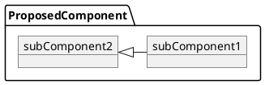
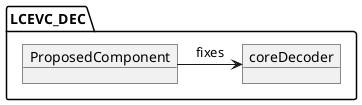
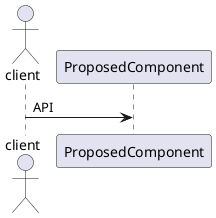

# Template design documentation <your design title here>

## Background
Give a brief overview of your proposed design and the motivation for it

## Object diagram
Explain how your design works at the block level

## Relationships
Explain how your design interfaces with other existing components

## Usage
If required, explain how any APIs or features will be used

If applicable, include API documentation for any new or modified endpoints

## Other
Any other details that reviewers should be aware of
