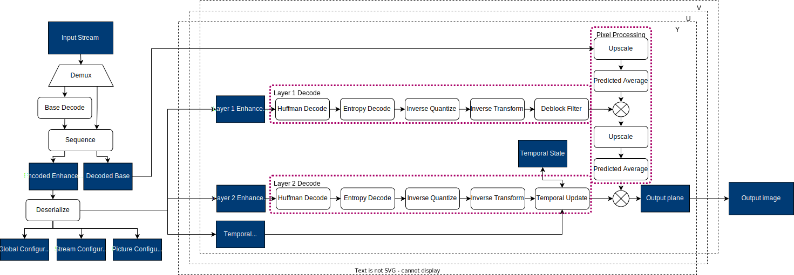

LCEVC Decoder SDK
=================

About
-----

Low Complexity Enhancement Video Codec Decoder (LCEVC_DEC) is the primary MPEG-5 Part 2 decoder SDK repository maintained by V-Nova. To learn what the LCEVC codec is and how it works, please refer to the `V-Nova documentation portal <https://docs.v-nova.com/v-nova/lcevc/lcevc-sdk-overview>`_.

Features
--------

 * Decode LCEVC compliant bitstreams
 * Support for a range of formats including YUV, NV12 and RGBA
 * Support for a range of colour formats including BT709 and BT2020
 * Support for HDR and 10-bit streams
 * Support for ABR ladders
 * CPU pixel processing stage
 * Extensive API

Block Diagram
-------------

